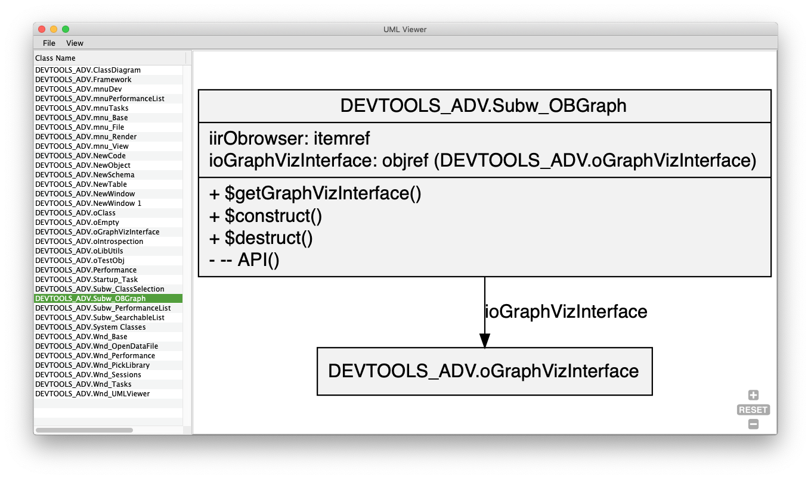

# OmnisDocUML

A tool for automating the UML Class Diagram generation for Omnis Classes.

## TODO list

- [ ] PNG export
- [ ] Diagram source editor
- [ ] Superclass relation

## Requirements

- Omnis Studio 8.1.x
- `gviz` installed in the `htmlcontrols` folder.
	- Requires `npm` for the dependencies management (`$ npm install`)
